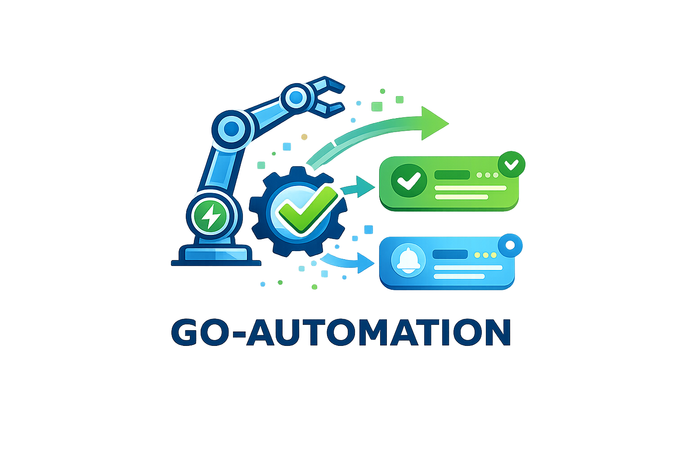

<p align="center">
  
</p>

# GO Automation

**GO Automation** è parte del **GO Software Development Kit (GO SDK)**, un toolkit progettato per abilitare processi e automazioni affidabili, osservabili e scalabili all'interno della Service Line QA&OPS di PagoPA.

## Panoramica Tecnica e Architettura

GO Automation costituisce il nucleo operativo del GO SDK ed è implementato come monorepo TypeScript. Il sistema adotta un approccio ingegneristico alle attivita di Quality Assurance e Gestione Operativa, trattando gli script e le automazioni come componenti software a tutti gli effetti: soggetti a processi formali di analisi, progettazione, sviluppo e manutenzione.

L'architettura del sistema si fonda su tre principi cardine che ne garantiscono affidabilità, manutenibilità e scalabilità nel tempo.

### Code Quality

Il controllo qualitativo del codice rappresenta il primo requisito architetturale. L'intera codebase opera in **TypeScript strict mode**, abilitando la rilevazione statica di errori, inconsistenze tipologiche e casi limite non gestiti in fase di compilazione anziché a runtime.

Il sistema di type-checking e integrato da strumenti di **analisi statica (ESLint)** configurati secondo standard rigorosi, che impongono uniformità stilistica e prevengono pattern problematici. Questo approccio consente di:

- Anticipare l'identificazione di difetti a _compile-time_
- Ridurre il rischio operativo in ambiente di produzione
- Concentrare l'effort di sviluppo sulla logica di business

### Common Core

La libreria `@go-automation/go-common` implementa il livello di astrazione condiviso dell'SDK. Questo componente centralizza le funzionalità trasversali, fornendo un'interfaccia unificata per:

| Funzionalità     | Descrizione                                                |
| ---------------- | ---------------------------------------------------------- |
| Inizializzazione | Bootstrap e configurazione degli script                    |
| Validazione      | Parsing e verifica di parametri CLI e variabili d'ambiente |
| Logging          | Sistema di logging strutturato con livelli di severità     |
| Error Handling   | Gestione standardizzata delle eccezioni                    |
| Output           | Formattazione consistente dei risultati                    |

L'adozione di un core condiviso garantisce che gli script rimangano snelli e focalizzati, delegando le responsabilità infrastrutturali a componenti già validati. Ogni ottimizzazione al core si propaga automaticamente a tutti i moduli dipendenti.

### Clean Structure

L'organizzazione del repository segue una struttura modulare domain-driven, con separazione netta tra componenti core e script eseguibili. I principi organizzativi includono:

- **Namespace gerarchico**: script raggruppati per dominio (`go/`, `send/`, `interop/`)
- **Convenzioni di naming uniformi**: coerenza tra package, file e identificatori
- **Configurazioni standardizzate**: template condivisi per `tsconfig.json` e `package.json`

Questa struttura riduce la complessità cognitiva, accelera l'onboarding di nuovi sviluppatori e minimizza il rischio di errori derivanti da ambiguità architetturali. Il sistema e progettato per scalare in modo ordinato, mantenendo governabilità anche al crescere della codebase.

## Quick Start

```bash
# Clone del repository
git clone git@github.com:pagopa/go-automation.git
cd go-automation

# Installazione dipendenze
pnpm install

# Build della libreria comune
pnpm build:common

# Esegui uno script
pnpm --filter=go-report-alarms dev -- --help
```

## Documentazione

| Documento                                      | Descrizione                                                    |
| ---------------------------------------------- | -------------------------------------------------------------- |
| [**Onboarding**](docs/ONBOARDING.md)           | **Guida rapida per i nuovi sviluppatori (Setup IDE, AWS SSO)** |
| [Architettura](docs/ARCHITECTURE.md)           | Struttura del monorepo, workspace pnpm, build system           |
| [go-common](docs/GOCOMMON.md)                  | Documentazione della libreria `@go-automation/go-common`       |
| [Coding Guidelines](docs/GUIDE_LINES.md)       | Standard di codifica, naming conventions, best practices       |
| [Scripts - Guida Completa](docs/SCRIPTS.md)    | Architettura, convenzioni, quality gates, Lambda, toolchain    |
| [**Deploy**](docs/DEPLOY.md)                   | **Guida alla pacchettizzazione e rilascio degli script**       |
| [**Troubleshooting**](docs/TROUBLESHOOTING.md) | **Soluzioni ai problemi comuni e FAQ**                         |
| [Runbook Engine](docs/RUNBOOKENGINE.md)        | Reference del motore di esecuzione runbook (go-common)         |

## Comandi Principali

### Build

```bash
pnpm build              # Build tutti i package
pnpm build:common       # Build solo go-common
pnpm build:scripts      # Build solo gli script
```

### Esecuzione Script

```bash
# Dev mode (con tsx, senza build)
pnpm --filter=<script-name> dev -- [options]

# Production mode (build + node)
pnpm --filter=<script-name> start -- [options]
```

### Creazione Nuovo Script

```bash
./bins/create-script.sh
```

### Creazione Nuova Lambda

```bash
./bins/create-lambda.sh
```

## Team e Contatti

**Team**: GO - Gestione Operativa (PagoPa)

**Repository**: [github.com/pagopa/go-automation](https://github.com/pagopa/go-automation)

---

**Ultima modifica**: 2026-04-10
